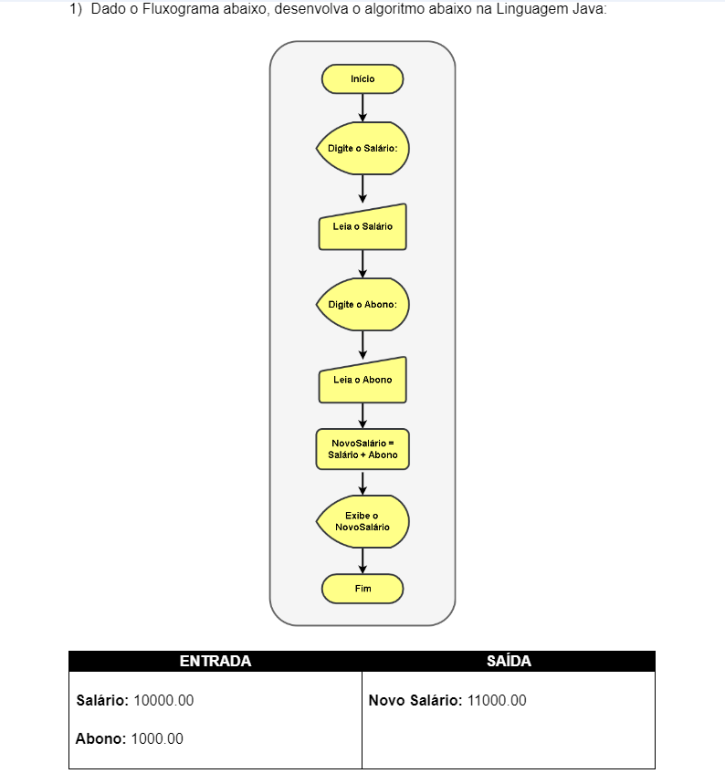
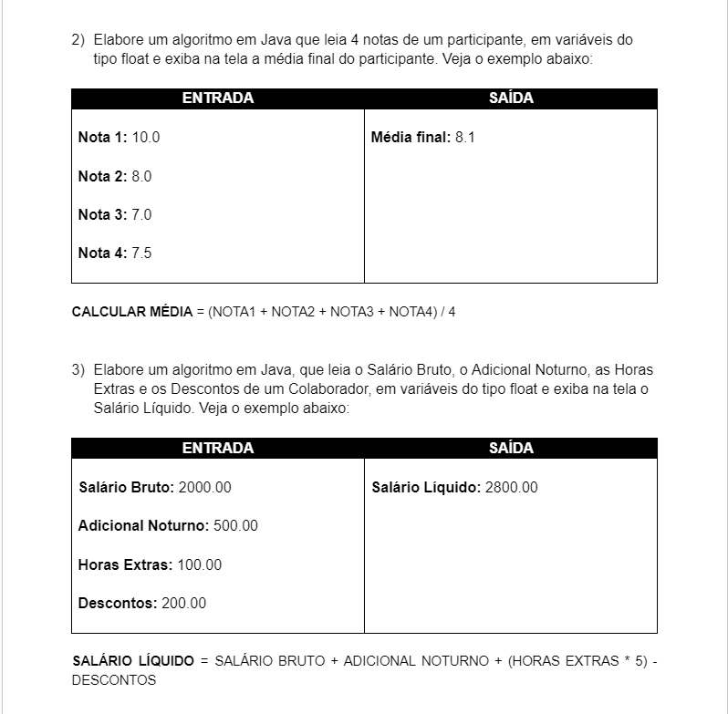
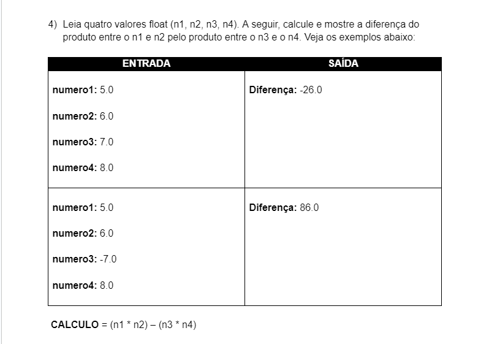
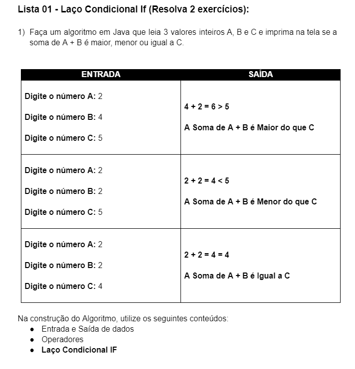
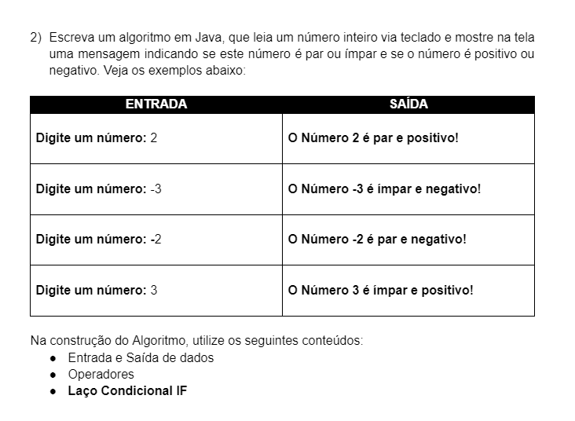
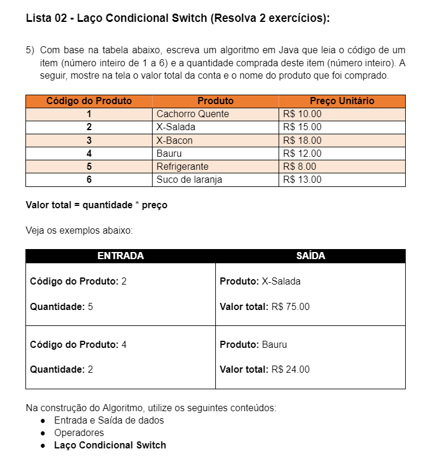
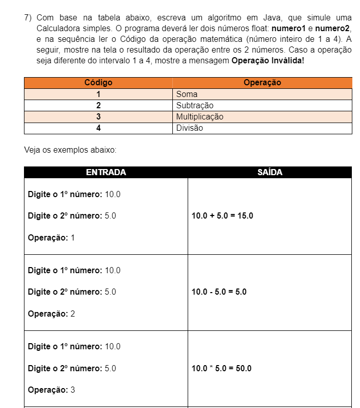

# Branches do projeto

<h3>Operacoes_aritmeticas:</h3>

<b>Exercício 1</b> 

 <b>Exercícios 2 e 3</b> 

 <b>Exercício 4</b> 

<h3>Lacos_condicionais:</h3>

 <b>Exercício 1</b> 

 <b>Exercício 2</b> 

 <b>Exercício 5</b> 

 <b>Exercício 7</b> 

